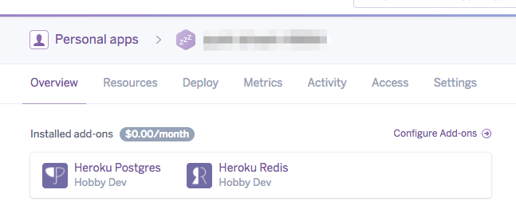

# [fit]前回のアプリを heroku にデプロイする

## 2017/05/28 tokushima.rb 34 
### @dany1468

---

# 前回作ったアプリ

## Action Cable を使った簡単なチャットアプリ

---

# 前回のアプリは手元で動作しますか？

参加していない人はそもそもコードが無いと思いますが :sweat_smile:

コード
[https://github.com/kaosf/20170430-tokushimarb-codes](https://github.com/kaosf/20170430-tokushimarb-codes)

元にしている資料。この Rails 5.1 対応版。
[Rails 5 + ActionCableで作る！シンプルなチャットアプリ - Qiita](http://qiita.com/jnchito/items/aec75fab42804287d71b)

---

特に動作させる必要も無いのでとりあえず clone して  bundle install だけ。

```
% git clone git@github.com:kaosf/20170430-tokushimarb-codes.git
% cd 20170430-tokushimarb-codes
% bundle install
```

PostgreSQL や Redis は heroku のを使います。

---

# heroku の設定は大丈夫？

Sign up
https://www.heroku.com/

heroku-cli install
https://devcenter.heroku.com/articles/heroku-cli

```
% heroku -v
heroku-cli/6.6.18-1a1fd10 (darwin-x64) node-v7.9.0
```

---

# ここまで問題無いですか？

では進めていきます。内容は以下の PR をなぞる感じ。
[https://github.com/JunichiIto/campfire/pull/3](https://github.com/JunichiIto/campfire/pull/3)

---

# 現在地確認

以降で実行するコマンドは基本的にアプリのディレクトリで実行します。

```bash
% pwd
みなさんの Action Cable アプリのディレクトリが表示
```

---

# heroku アプリの作成

```bash
# terminal
% heroku create

Creating app... done, ⬢ quiet-stream-xxxxx
https://quiet-stream-xxxxx.herokuapp.com/ | 
https://git.heroku.com/quiet-stream-xxxxx.git
```

---

# heroku redis アドオンの追加

```bash
% heroku addons:create heroku-redis

Creating heroku-redis on ⬢ quiet-stream-xxxxx... free
Your add-on should be available in a few minutes.
! WARNING: Data stored in hobby plans on Heroku Redis are not persisted.
redis-fluffy-xxxxx is being created in the background. 
The app will restart when complete...
Use heroku addons:info redis-fluffy-xxxxx to check creation progress
Use heroku addons:docs heroku-redis to view documentation
```

---

# 管理画面で確認

https://dashboard.heroku.com/apps/quiet-stream-xxxxx



---

# 追加の設定

---

## kaosf/20170430-tokushimarb-codes の場合

clone して自分のリポジトリにするか、ブランチを作ります。

```bash
# 適当なブランチ名で
% git checkout -b for_20170528
```

---

## redis-rb の依存の追加

Rails 5.0.0.beta2 の時点で Redis の依存が消えている[^2]ため明示的に追加する必要があります。

```ruby
# Gemfile
gem 'redis'
```

```ruby
# terminal
% bundle install
% git add Gemfile Gemfile.lock
% git commit -m 'bundle redis-rb'
```

[^2]:https://github.com/rails/rails/commit/55e33667a6da92bea28eef8c3a435f45dbf6597b#diff-6768ca12fa1811630cc5004e025d011f

---

## config/cable.yml の修正

デフォルトでは production は localhost の Redis、他は async というのを利用しています。
heroku 上では、先ほど追加したアドオンの Redis を参照します。

```ruby
development:
  adapter: async

test:
  adapter: async

production:
  adapter: redis
  url: 'redis://localhost:6379/1'
  channel_prefix: mychat_production
```

---

## heroku の Redis の URL

Redis 関連の設定を探す[^1]と、`REDIS_URL` が取得できることが分かります。
これは環境変数としてアプリから利用できます。

```bash
% heroku config | grep REDIS
REDIS_URL: redis://h:xxxx.compute-1.amazonaws.com:33189
```

[^1]: https://devcenter.heroku.com/articles/heroku-redis

---

## config/cable.yml の修正

production の URL を環境変数を見るように変更。

```ruby,[.highlight: 9]
development:
  adapter: async

test:
  adapter: async

production:
  adapter: redis
  url: <%= ENV['REDIS_URL'] || 'redis://localhost:6379/1' %>
  channel_prefix: mychat_production
```

---

## デプロイ

```bash
# 自分のリポジトリの人
% git push heroku master

# ブランチの人は以下
% git push heroku for_20170528:master

% heroku run rails db:migrates
% heroku open
```

---

# 元記事との違いについて

- 接続先制限について
- rails_12factor について

---

## 接続先制限について

今回参考にした記事は Rails 5.0.0.beta1 時だったので、`allowed_request_origins` での接続元の設定緩和が必要だったのですが、5.1.0.beta1 の時点[^3]で同一オリジン[^4]の場合は通すようになったので、不要になりました。

[herokuでrails5のチャットアプリの公開 - stackoverflow](https://ja.stackoverflow.com/questions/20308/heroku%E3%81%A7rails5%E3%81%AE%E3%83%81%E3%83%A3%E3%83%83%E3%83%88%E3%82%A2%E3%83%97%E3%83%AA%E3%81%AE%E5%85%AC%E9%96%8B)

[^3]:https://github.com/rails/rails/pull/26568

[^4]:スキーム、ホスト、ポートが同じこと

---

## rails_12factor について


`RAILS_LOG_TO_STDOUT` の環境変数が入ったのは 12factorapp に沿うためだったのか。