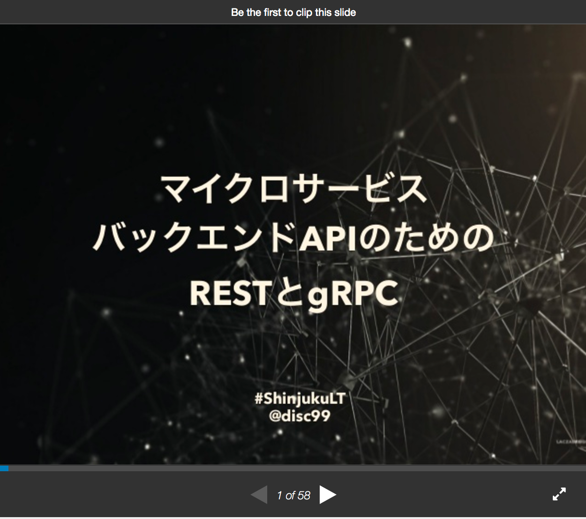

# GRPC と Rails で使ってみる

## 2017/06/25 tokushima.rb 35
### @dany1468

---

## GRPC is 何？

すでに資料はたくさんあるので、個人的に自分のポジション (Rails でお仕事) や自分の気持ち (REST に疲れ) にあった資料を紹介します。

---


[http://sssslide.com/speakerdeck.com/kazegusuri/go-conference-2016-spring](http://sssslide.com/speakerdeck.com/kazegusuri/go-conference-2016-spring)

---



[REST APIの設計で消耗している感じたときのgRPC入門](http://qiita.com/disc99/items/cfca50a32240284578bb)
[https://www.slideshare.net/disc99_/apirestgrpc](https://www.slideshare.net/disc99_/apirestgrpc)

---

## Agenda

1. GRPC Ruby Quick Start をやってみよう
2. GRPC Server を Rails アプリとして動かしてみよう

---

## 1. GRPC Ruby Quick Start をやってみよう

---

## GRPC: Ruby

公式でサポートされているので公式ドキュメントがあります。

Ruby Quick Start
http://www.grpc.io/docs/quickstart/ruby.html

gRPC Basics - Ruby
http://www.grpc.io/docs/tutorials/basic/ruby.html

---

## さくっと動かしてみよう

```bash
$ gem install grpc
$ gem install grpc-tools
$ git clone -b v1.3.x https://github.com/grpc/grpc
$ cd grpc/examples/ruby
$ ruby greeter_server.rb
```

```bash
# 別ターミナルで実行
$ ruby greeter_client.rb
"Greeting: Hello world"
```

---

## Protocol Buffer 定義を修正してコードを自動生成してみよう

ドキュメント見ながらやります

---

## [fit] 2. GRPC Server を Rils アプリとして動かしてみよう

---

## ここでのゴール

GRPC サーバーを Rails のコンテキストで動かして、ActiveRecord モデルとやりとりできるようにする

> なので、とても production レベルで使えるものではないです :cry:

---

## rails new

```bash
% bundle exec rails new -B --skip-turbolinks --skip-test
# MySQL なら '-d mysql', PostgreSQL なら '-d postgresql' をつけてください
% bundle install
```

---

## grpc gem を追加

```ruby
# Gemfile
gem 'grpc'
```

---

## 作成したサンプルアプリが動作するか確認

```bash
% bundle exec rails s
```

画面は表示できましたか？

---

## GRPC のサーバーを Rails に移動する

雑に grpc server を lib にコピーしてきます。

```
# コピー対象
grpc/examples/ruby/
  - greeter_server.rb
  - lib/
    + hello_world_pb.rb
    + hello_world_services_pb.rb
```

---

## greeter_server からサーバー起動部分を取り出す

```ruby
# grpc_server.rb
class GrpcServer
  # greeter_server から main メソッドを移動させてくる
  def main
    s = GRPC::RpcServer.new
    s.add_http2_port('0.0.0.0:50051', :this_port_is_insecure)
    s.handle(GreeterServer)
    s.run_till_terminated
  end

  # main を呼んでいるコードは削除
end
```

---

## grpc のサーバーを Rails に移動する

libをロードパスに入れておきます。

```ruby,[.highlight: 3]
module App
  class Application < Rails::Application
    config.autoload_paths += Dir["#{config.root}/lib/**/"]
```

---

まずは、rails console で実行してみましょう

```bash
% bin/rails c
```

```ruby
# in console...
irb> GrpcServer.new.main
```

```bash
% ruby greeter_client.rb
```

同様に取得できましたか？

---

# [fit] ActiveRecord のデータを返すようにする

---

## モデルを作る

```bash,[.highlight: 1-2]
% bin/rails g model Message body:string
% bin/rails db:migrate
== 20170624222226 CreateMessages: migrating ===================================
-- create_table(:messages)
   -> 0.0997s
== 20170624222226 CreateMessages: migrated (0.0998s) ==========================
```

---

## テストデータの投入

```bash
% bin/rails c
```

```ruby
irb> Message.create(body: '最初のメッセージ')
irb> Message.all
```

メッセージは登録できましたか？

---

## 動作確認

```bash
% bin/rails c
```

```ruby
irb> GrpcServer.new.main
```

```bash
% ruby greeter_client.rb
"Greeting: Hello world 最初のメッセージ"
"Greeting: Hello again, world"
```

取得できましたか？

---

## grpc サーバーの起動スクリプトにする

```ruby
#!/usr/bin/env ruby
# frozen_string_literal: true
require ::File.expand_path('../../config/environment', __FILE__)

Rails.application.eager_load!

GrpcServer.new.main

puts 'grpc server start...'
```

上記を `bin/grpc` で保存します。

---

サーバーの起動スクリプトで実行してみます。

```bash
% chmod +x bin/grpc
% bundle exec bin/grpc
```

```bash
# 別ターミナルで実行
% ruby greeter_client.rb
```

同様に取得できましたか？

---

本日のコードはこちら
https://github.com/dany1468/grpc_rails_sample/tree/with_rails